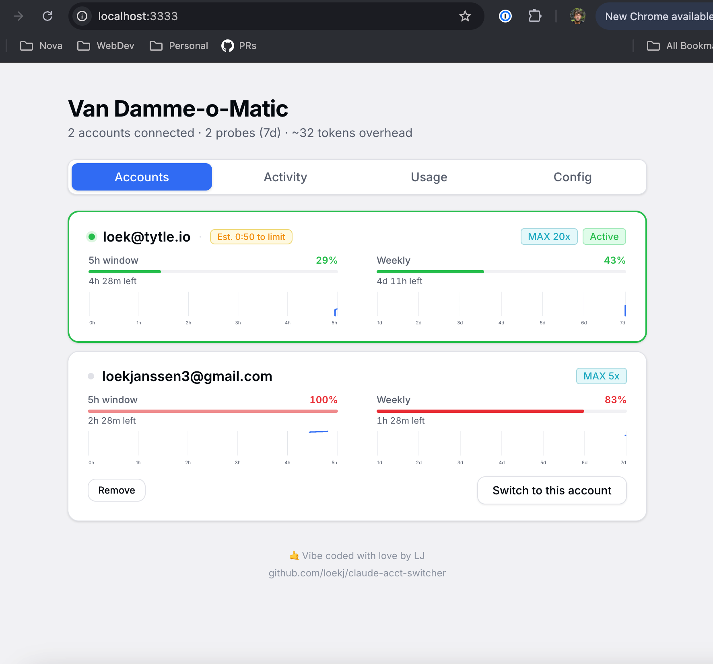

# Van Damme-o-Matic


---

## Why This Exists / Who Is This For

You don't sleep. Your Claude Code sessions run 24/7 via `--remote-control`. You're doing stuff around town, laptop in backpack connected to hotspot where you're remote-controlling Claude the entire day. While you're in line at the DMV your machine's doing roundhouse kicks, and then, ..., you're rate limited. Session dead. Work stopped.

What does Anthropic want you to do? Log in again. Through their slow, annoying UI. Click click click wait click. Meanwhile your autonomous agent is sitting there like a DMV sloth, doing absolutely nothing. Valuable vibe code minutes are being wasted...

**No. Absolutely not.**

Jean-Claude's on automatic mode from now on.

Van Damme-o-Matic does the splits across multiple accounts so you never have to. It auto-switches on rate limits, auto-refreshes expiring tokens, and keeps your sessions alive while you're nowhere near a keyboard. NEVER EVER get bogged down because you need to log in to a new account through Anthropic's slow annoying UI again.

- **`--remote-control` power users**  - your machine works while you don't
- **People running multiple Claude Code sessions**  - spread the load, never hit a wall
- **Anyone who refuses to babysit token expiry**  - tokens refresh themselves, accounts rotate automatically
- **Night owls, insomniacs, and the simply relentless**  - your AI doesn't sleep and neither should your account management

---



## Install

```bash
git clone https://github.com/loekj/claude-acct-switcher.git
cd claude-acct-switcher
./install.sh
```

Restart your terminal. Done. The proxy auto-starts on new shells.

**Requirements:** macOS, Node.js 18+, python3, Claude Code CLI.

## Usage

Accounts are auto-discovered — just log in:

```bash
claude login    # account A
claude login    # account B — that's it
```

### CLI (`vdm`)

```
vdm list                    List accounts
vdm switch [name]           Switch account
vdm remove <name>           Remove account
vdm status                  Current account + settings
vdm config [key] [on|off]   View/toggle settings
vdm dashboard [start|stop]  Dashboard control
```

### Dashboard

`http://localhost:3333` — accounts, rate limits, usage, activity log.

### Settings

```bash
vdm config proxy on|off           # Token-swapping proxy
vdm config autoswitch on|off      # Auto-switch on 429/401
vdm config rotation <strategy>    # sticky|conserve|round-robin|spread|drain-first
vdm config interval <minutes>     # Round-robin timer
```

### Rotation Strategies

| Strategy | Behavior |
|----------|----------|
| **Sticky** (default) | Stay on current account, only switch on rate limit |
| **Conserve** | Drain active accounts first, keep unused ones dormant |
| **Round-robin** | Rotate every N minutes |
| **Spread** | Always pick lowest utilization |
| **Drain first** | Use highest 5hr utilization first |

## How It Works

```
Claude Code  ──ANTHROPIC_BASE_URL──>  Local Proxy (:3334)  ──>  api.anthropic.com
                                          |
                                          |-- Picks account per rotation strategy
                                          |-- Swaps Authorization header
                                          |-- On 429 → retries with next account
                                          |-- On 401 → refreshes token, then switches
                                          '-- Background token refresh (every 5 min)
```

Credentials live in the macOS Keychain. The proxy reads the active token, replaces the auth header, and forwards to Anthropic. On 429, it writes the next account's credentials to the Keychain and retries — Claude Code picks up the change seamlessly.

## Ports

| Port | Service | Env Override |
|------|---------|-------------|
| 3333 | Web Dashboard | `CSW_PORT` |
| 3334 | API Proxy | `CSW_PROXY_PORT` |

## Testing

```bash
node --test 'test/*.test.mjs'
```

## Uninstall

```bash
./uninstall.sh
```

Keychain credentials are not touched — Claude Code keeps working normally.

## License

[The Unlicense](LICENSE) — public domain.

---


