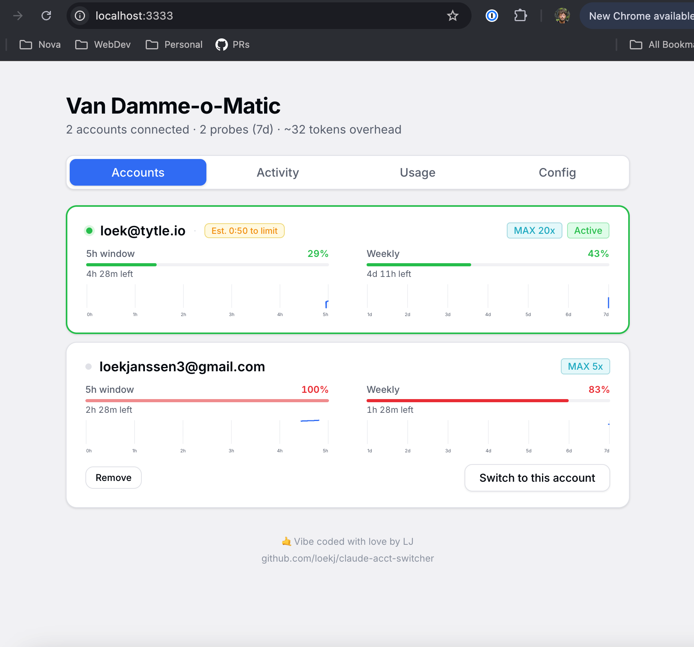

# Van Damme-o-Matic


---

## Why This Exists / Who Is This For

You don't sleep. Your Claude Code sessions run 24/7 via `--remote-control`. You're doing stuff around town, laptop in backpack connected to hotspot where you're remote-controlling Claude the entire day. While you're in line at the DMV your machine's doing roundhouse kicks, and then, ..., you're rate limited. Session dead. Work stopped.

What does Anthropic want you to do? Log in again. Through their slow, annoying UI. Click click click wait click. Meanwhile your autonomous agent is sitting there like a DMV sloth, doing absolutely nothing. Valuable vibe code minutes are being wasted...

**No. Absolutely not.**

Jean-Claude's on automatic mode from now on.

Van Damme-o-Matic does the splits across multiple accounts so you never have to. It auto-switches on rate limits, auto-refreshes expiring tokens, and keeps your sessions alive while you're nowhere near a keyboard. NEVER EVER get bogged down because you need to log in to a new account through Anthropic's slow annoying UI again.

- **`--remote-control` power users**  - your machine works while you don't
- **People running multiple Claude Code sessions**  - spread the load, never hit a wall
- **Anyone who refuses to babysit token expiry**  - tokens refresh themselves, accounts rotate automatically
- **Night owls, insomniacs, and the simply relentless**  - your AI doesn't sleep and neither should your account management

---



## Install

```bash
git clone https://github.com/loekj/claude-acct-switcher.git
cd claude-acct-switcher
./install.sh
```

Restart your terminal. Done. The proxy auto-starts on new shells.

**Requirements:** macOS, Node.js 18+, python3, Claude Code CLI.

### Upgrade

```bash
vdm upgrade
```

Fetches the latest release, auto-installs hooks, and restarts the dashboard.

## Usage

Accounts are auto-discovered — just log in:

```bash
claude login    # account A
claude login    # account B — that's it
```

### CLI (`vdm`)

```
vdm list                    List accounts
vdm switch [name]           Switch account (interactive if no name)
vdm remove <name>           Remove account
vdm status                  Current account + settings
vdm config [key] [on|off]   View/toggle settings
vdm dashboard [start|stop]  Dashboard control
vdm logs [filter]           Stream live proxy logs
vdm tokens [options]        Show token usage (BETA)
vdm upgrade                 Update to latest version
```

### Dashboard

`http://localhost:3333` — accounts, rate limits, token usage, activity log.

#### Tokens Tab (BETA)

Per-session token usage tracking with breakdowns by model, repo, branch, and time range.

- **Filter row** — repo, branch, model, and time range (1d/7d/30d/90d)
- **Summary stats** — total tokens, input, output, requests at a glance
- **Daily stacked bar chart** — per-model colored segments with hover tooltips
- **Model breakdown** — input/output split with proportional bars
- **Repo/branch breakdown** — sorted by total tokens, with per-model detail

Token usage is tracked via Claude Code hooks and attributed to the correct git repo and branch — including worktrees.

#### Commit Token Trailers

When enabled, a `prepare-commit-msg` git hook appends a `Token-Usage:` trailer to each commit message showing the tokens consumed since the previous commit. This is **disabled by default**.

To enable:

```bash
vdm config commit-tokens on
```

Example commit message:

```
Fix login validation bug

Token-Usage: 12,345 tokens (claude-sonnet-4-20250514)
```

The hook queries the dashboard for usage data and silently skips the trailer if the dashboard is unreachable or the setting is off. Merge, squash, and amend commits are always skipped. After changing this setting, run `vdm hooks` to reinstall the hook.

### Settings

```bash
vdm config proxy on|off           # Token-swapping proxy
vdm config autoswitch on|off      # Auto-switch on 429/401
vdm config rotation <strategy>    # sticky|conserve|round-robin|spread|drain-first
vdm config interval <minutes>     # Round-robin timer
vdm config serialize on|off       # Serialize proxy requests
vdm config serialize-delay <ms>   # Serialization delay
vdm config commit-tokens on|off  # Token-Usage trailer in commits
```

### Rotation Strategies

| Strategy | Behavior |
|----------|----------|
| **Sticky** (default) | Stay on current account, only switch on rate limit |
| **Conserve** | Drain active accounts first, keep unused ones dormant |
| **Round-robin** | Rotate every N minutes |
| **Spread** | Always pick lowest utilization |
| **Drain first** | Use highest 5hr utilization first |

## How It Works

```
Claude Code  ──ANTHROPIC_BASE_URL──>  Local Proxy (:3334)  ──>  api.anthropic.com
                                          |
                                          |-- Picks account per rotation strategy
                                          |-- Swaps Authorization header
                                          |-- On 429 → retries with next account
                                          |-- On 401 → refreshes token, then switches
                                          |-- On 400 → multi-layer recovery (4 strategies)
                                          |-- Background token refresh (every 5 min)
                                          |-- Passthrough fallback if all recovery fails
                                          '-- Circuit breaker auto-disables on repeated failures
```

Credentials live in the macOS Keychain. The proxy reads the active token, replaces the auth header, and forwards to Anthropic. On 429, it writes the next account's credentials to the Keychain and retries — Claude Code picks up the change seamlessly.

### Proxy Resilience

The proxy is designed to never kill your Claude Code sessions, even when things go wrong:

**Passthrough fallback** — When all proxy recovery strategies fail (expired tokens, network errors, auth failures), the request is forwarded with the original client auth header. This lets Claude Code reach the real API and trigger its own re-auth flow, instead of receiving an opaque error that permanently kills the session.

**Circuit breaker** — After 3 consecutive total failures, the proxy auto-disables into passthrough mode for 2 minutes. All requests go straight to Anthropic with the client's own auth. After the cooldown, proxy mode is re-engaged automatically.

**400 error recovery** — When the API returns 400 (which can mean bad tokens, expired OAuth, or malformed headers), four escalating strategies are tried:

1. Bulk token refresh — force-refresh all account tokens in parallel
2. Single token refresh — refresh the failing account
3. Account switch — try a different account
4. Minimal headers retry — strip all forwarded headers, retry with essentials only

**Sleep recovery** — After laptop sleep, all tokens may expire simultaneously. The proxy detects this and refreshes tokens in parallel (~37s) instead of sequentially (37s × N accounts). A 45-second request deadline prevents indefinite hangs.

### Worktree Support

Sessions running in git worktrees are correctly grouped with the parent repo in the dashboard and token tracking. The proxy resolves the main repo root via `--git-common-dir` and re-reads the checked-out branch on every prompt.

## Ports

| Port | Service | Env Override |
|------|---------|-------------|
| 3333 | Web Dashboard | `CSW_PORT` |
| 3334 | API Proxy | `CSW_PROXY_PORT` |

## Testing

```bash
node --test 'test/*.test.mjs'
```

## Uninstall

```bash
./uninstall.sh
```

Keychain credentials are not touched — Claude Code keeps working normally.

## License

[The Unlicense](LICENSE) — public domain.

---


