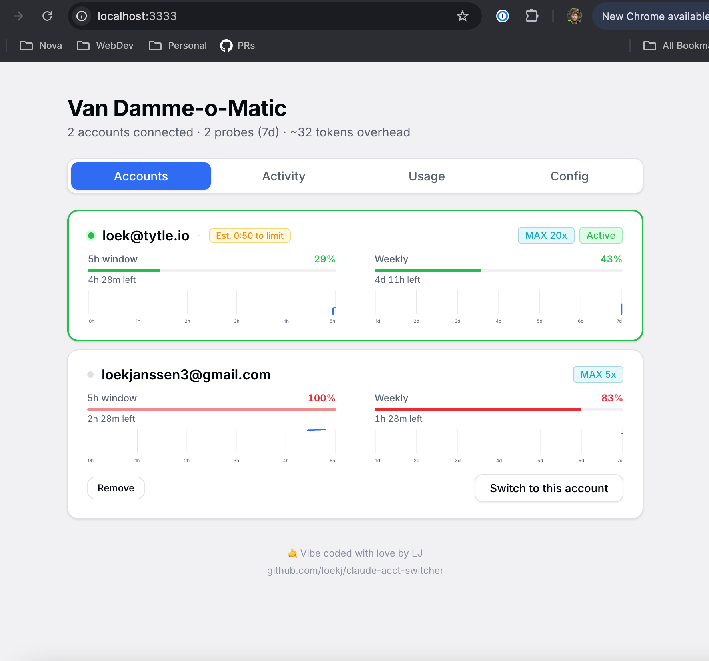

# Van Damme-o-Matic


---

## Why This Exists / Who Is This For

You don't sleep. Your Claude Code sessions run 24/7 via `--remote-control`. You're doing stuff around town, laptop in backpack connected to hotspot where you're remote-controlling Claude the entire day. While you're in line at the DMV your machine's doing roundhouse kicks, and then, ..., you're rate limited. Session dead. Work stopped.

What does Anthropic want you to do? Log in again. Through their slow, annoying UI. Click click click wait click. Meanwhile your autonomous agent is sitting there like a DMV sloth, doing absolutely nothing. Valuable vibe code minutes are being wasted...

**No. Absolutely not.**

Jean-Claude's on automatic mode from now on.

Van Damme-o-Matic does the splits across multiple accounts so you never have to. It auto-switches on rate limits, auto-refreshes expiring tokens, and keeps your sessions alive while you're nowhere near a keyboard. NEVER EVER get bogged down because you need to log in to a new account through Anthropic's slow annoying UI again.

- **`--remote-control` power users**  - your machine works while you don't
- **People running multiple Claude Code sessions**  - spread the load, never hit a wall
- **Anyone who refuses to babysit token expiry**  - tokens refresh themselves, accounts rotate automatically
- **Night owls, insomniacs, and the simply relentless**  - your AI doesn't sleep and neither should your account management

---



## Install

```bash
git clone https://github.com/loekj/claude-acct-switcher.git
cd claude-acct-switcher
./install.sh
```

Restart your terminal. Done. The proxy auto-starts on new shells.

**Requirements:** macOS, Node.js 18+, python3, Claude Code CLI.

### Upgrade

```bash
vdm upgrade
```

Fetches the latest release, removes hooks older versions installed, and restarts the dashboard.

## Usage

Accounts are auto-discovered — just log in:

```bash
claude login    # account A
claude login    # account B — that's it
```

### CLI (`vdm`)

```
vdm list                    List accounts
vdm switch [name]           Switch account (interactive if no name)
vdm remove <name>           Remove account
vdm status                  Current account + settings
vdm config [key] [on|off]   View/toggle settings
vdm dashboard [start|stop]  Dashboard control
vdm logs [filter]           Stream live proxy logs
vdm tokens [--days N]       Show token usage and API-price value
vdm upgrade                 Update to latest version
```

### Dashboard

`http://localhost:3333`  - accounts, sessions, artifacts, usage, activity log.

#### Accounts

Per account: 5h and weekly windows, plus a separate **Fable weekly** bar when the account has that bucket (Fable has its own weekly limit). Each card lists the Claude Code sessions that ran through it in the last 24 hours, the account's 30-day cache hit rate, and how many artifacts it owns.

#### Sessions & affinity

Prompt caches live per account. When a running session jumps to another account, its whole cache is written again there (1.25-2x the input price instead of ~0.1x), and limits burn faster.

With **session affinity** (on by default) every Claude Code session  - and each of its subagents  - stays on one account while its cache is warm. It only moves when that account is rate limited, used up, expired or failing. The rotation strategy decides where *new* and *idle* sessions go. Works with every strategy.

Sessions are named by their `/rename` name, else `branch:id`. Each shows an affinity indicator:

| Bars | Meaning |
|------|---------|
| 3 green | Locked: no move with a warm cache in the last hour |
| 2 yellow | Holding: one warm move in the last hour, or requests a bit spread |
| 1 red | Drifting: repeated warm moves or requests spread over accounts |

#### Artifacts

Claude Code publishes artifacts with its own login (the account in the Keychain), not through the proxy. The Artifacts tab asks every account which artifacts it owns (every 15 minutes, or on demand). Paste an artifact link to find its owner. Artifact links seen in a session's messages are linked to that session.

#### Usage

Every request through the proxy is counted (input, output, cache reads, cache writes), per account, model, repo and branch. Data is kept as hourly rollups in `usage/` (one file per day), so it survives restarts and re-logins and has no row cap.

- **Plan value**  - each Max account's subscription price (20x $200, 5x $100, prorated) vs the same usage at API prices
- **Cache efficiency**  - rolling 30-day cache hit rate per account and per model, with a daily trend
- Model, account and repo/branch breakdowns; CSV export of the hourly rows

### Settings

```bash
vdm config proxy on|off           # Token-swapping proxy
vdm config autoswitch on|off      # Auto-switch on 429/401
vdm config rotation <strategy>    # sticky|conserve|round-robin|spread|drain-first
vdm config interval <minutes>     # Round-robin timer
vdm config serialize on|off       # Serialize proxy requests
vdm config serialize-delay <ms>   # Serialization delay
vdm config affinity on|off        # Keep each session on one account
```

### Rotation Strategies

| Strategy | Behavior |
|----------|----------|
| **Sticky** (default) | Stay on current account, only switch on rate limit |
| **Conserve** | Drain active accounts first, keep unused ones dormant |
| **Round-robin** | Rotate every N minutes |
| **Spread** | Always pick lowest utilization |
| **Drain first** | Use highest 5hr utilization first |
| **Balance** | Put new sessions on the least-loaded account, capped per account |

All strategies skip accounts whose 5h or weekly window is used up. Per-model weekly limits (Fable, and weekly Opus or Sonnet limits) only steer that model's requests away; other models keep using the account. With session affinity on, the strategy only places new and idle sessions.

## How It Works

```
Claude Code  ──ANTHROPIC_BASE_URL──>  Local Proxy (:3334)  ──>  api.anthropic.com
                                          |
                                          |-- Keeps each session on its account (affinity)
                                          |-- Places new sessions per rotation strategy
                                          |-- Swaps Authorization header
                                          |-- On 429 → retries with next account
                                          |-- On 401 → refreshes token, then switches
                                          |-- On 400 → multi-layer recovery (4 strategies)
                                          |-- Background token refresh (every 5 min)
                                          |-- Passthrough fallback if all recovery fails
                                          '-- Circuit breaker auto-disables on repeated failures
```

Credentials live in the macOS Keychain. The proxy reads the active token, replaces the auth header, and forwards to Anthropic. On 429, it writes the next account's credentials to the Keychain and retries — Claude Code picks up the change seamlessly.

### Proxy Resilience

The proxy is designed to never kill your Claude Code sessions, even when things go wrong:

**Passthrough fallback** — When all proxy recovery strategies fail (expired tokens, network errors, auth failures), the request is forwarded with the original client auth header. This lets Claude Code reach the real API and trigger its own re-auth flow, instead of receiving an opaque error that permanently kills the session.

**Circuit breaker** — After 3 consecutive total failures, the proxy auto-disables into passthrough mode for 2 minutes. All requests go straight to Anthropic with the client's own auth. After the cooldown, proxy mode is re-engaged automatically.

**400 error recovery** — When the API returns 400 (which can mean bad tokens, expired OAuth, or malformed headers), four escalating strategies are tried:

1. Bulk token refresh — force-refresh all account tokens in parallel
2. Single token refresh — refresh the failing account
3. Account switch — try a different account
4. Minimal headers retry — strip all forwarded headers, retry with essentials only

**Sleep recovery** — After laptop sleep, all tokens may expire simultaneously. The proxy detects this and refreshes tokens in parallel (~37s) instead of sequentially (37s × N accounts). A 45-second request deadline prevents indefinite hangs.

### Worktree Support

Sessions running in git worktrees are grouped with the parent repo in the Usage tab. The proxy resolves the main repo root via `--git-common-dir` and maps Claude Code's `worktree-*` branches back to the real branch.

## Ports

| Port | Service | Env Override |
|------|---------|-------------|
| 3333 | Web Dashboard | `CSW_PORT` |
| 3334 | API Proxy | `CSW_PROXY_PORT` |

## Testing

```bash
node --test 'test/*.test.mjs'
```

To run a throwaway copy of the proxy without touching your real login, point it at a test Keychain item and a stand-in API: `CSW_KEYCHAIN_SERVICE=vdm-test CSW_UPSTREAM=http://127.0.0.1:9999 CSW_PORT=4333 CSW_PROXY_PORT=4334 node dashboard.mjs` (run it from a copy with its own `accounts/`).

## Uninstall

```bash
./uninstall.sh
```

Keychain credentials are not touched — Claude Code keeps working normally.

## License

[The Unlicense](LICENSE) — public domain.

---


